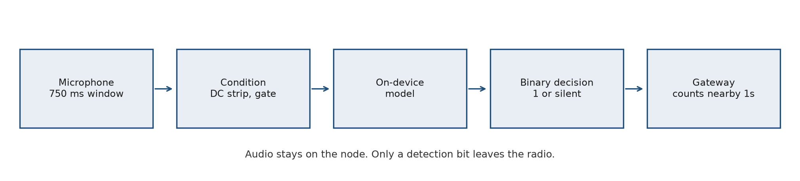
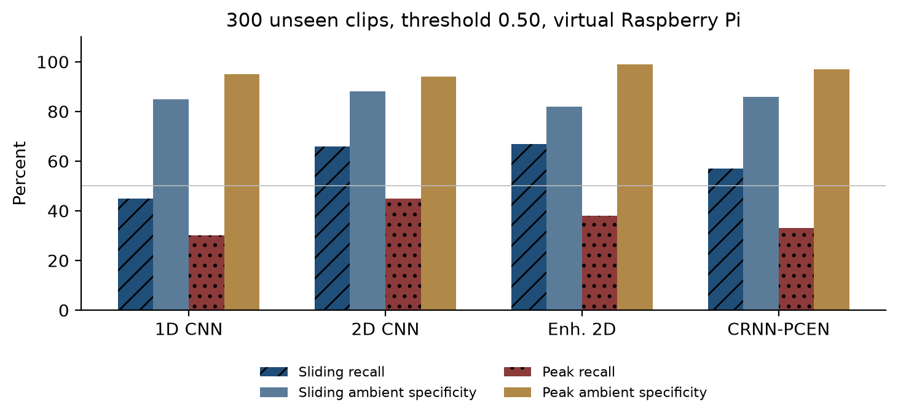
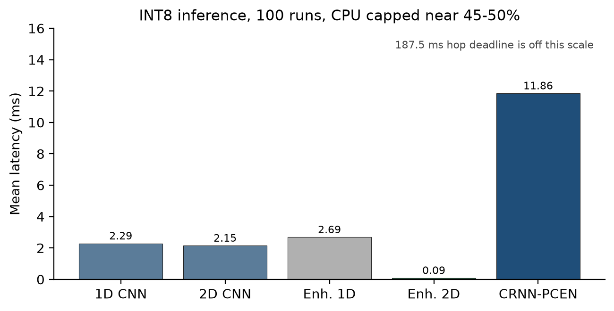
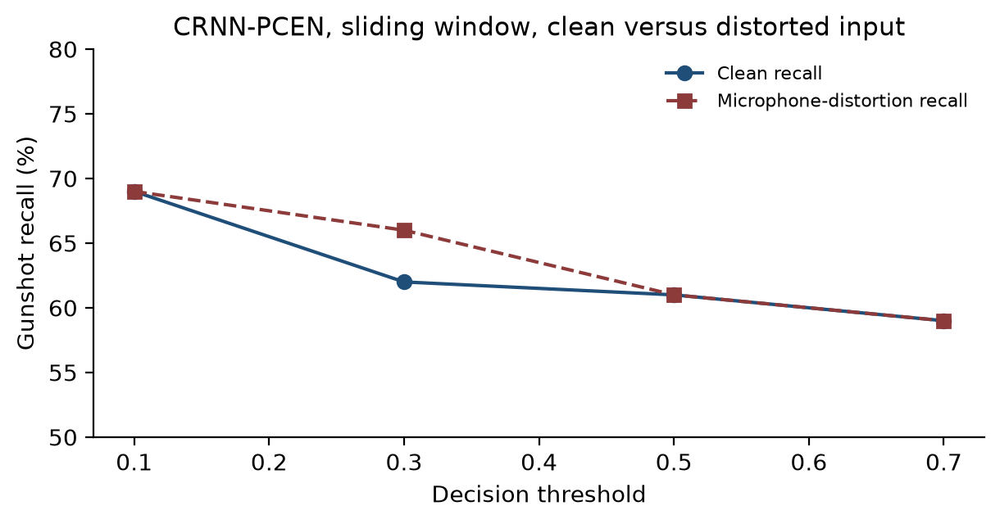
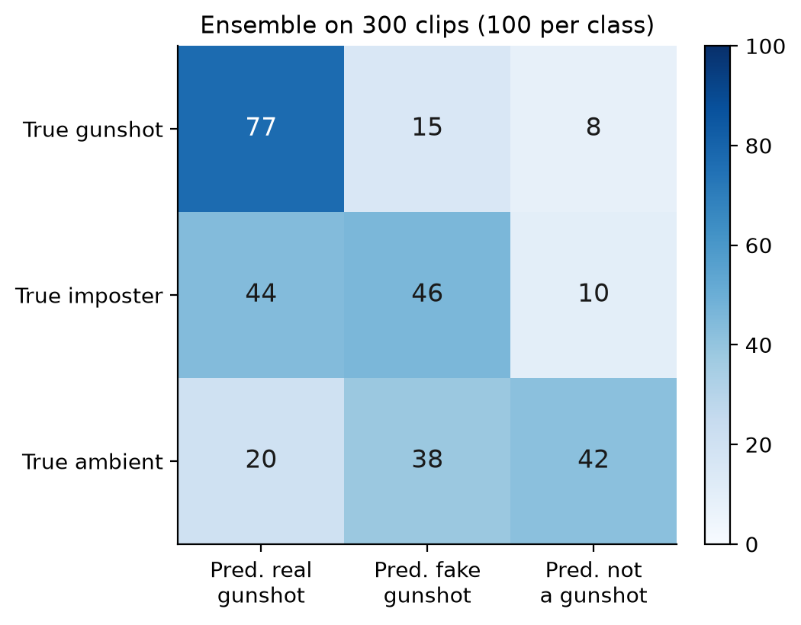

# On-Device Acoustic Gunshot Detection: Data Cleaning, Model Comparison, and a One-Bit Edge Alert

**Jeevant Sharma, Deepesh Dangi, Abhishek Yadav, Bhupendra Kumar**  
Department of Computer Science and Engineering, Indian Institute of Information Technology, Surat  
Advisor: Dr. Kaustubh Dhondge

---

## Abstract

A gunshot is a short impulse in a long recording. The same impulse shape appears in fireworks, hand claps, and door slams, so a detector that looks perfect on a balanced folder of clips can still be useless on a live microphone. This paper reports the detector we built toward an Arduino Nano 33 BLE Sense node. Training and the tests in this paper were done on a PC. Edge timing was measured on a virtual machine capped near 45-50% CPU, used as a stand-in for a Raspberry Pi 4. No physical board has been flashed yet.

Audio was cleaned with librosa. Fixed cuts of 250 ms, 500 ms, and 1 s were compared. A 250 ms cut keeps the attack and drops most of the decay, so a shot and a knock become hard to tell apart. The working window is 750 ms at 22,050 Hz. Logistic regression, an SVM, and a random forest reached about 99-100% on some balanced test files and then failed when the input was a real microphone. Five neural models were trained next. On a balanced hold-out of 1,442 clips, three of them exceed 99.5% accuracy. On 300 unseen recordings the best sliding-window gunshot recall is 67%. The Enhanced 2D CNN runs in 0.09 ms and occupies 123.6 KB after INT8 quantization.

The deployment design, which is not yet on hardware, keeps audio on the node. The node sleeps, wakes on a loud frame, runs the model, and transmits a single decision bit: 1 if the score crosses the threshold, and nothing if it does not. A gateway accepts an event only when several nearby nodes report that bit. This one-bit output is a binary decision from an ordinary network. It is not a weight-binarized neural network.

**Keywords:** acoustic gunshot detection, edge inference, TinyML, PCEN, Raspberry Pi, Arduino Nano 33 BLE Sense.

---

## 1. Introduction

In some countries a person may carry a firearm with a licence. In others the same sound on a street is already a crime. Either way, the people nearby do not always call for help, and a call that does arrive is often late and poorly located. A city, a campus, or a forest sanctuary can instead listen for the sound itself. If the event is known quickly, medical help and the police can be sent to the place rather than to a vague report. The same listening problem appears in wildlife reserves, where a gunshot or a chainsaw is rare against hours of wind and insects. We did not build a chainsaw detector. We only reuse a front-end that was developed for that kind of rare impulse.

A dense city is a hard first site. Crowds, traffic, and fireworks produce impulses all day, and placing and checking nodes is difficult. A college or a school is a smaller site where the same node, the same model, and the same alert path can be tried with a known map. That is the deployment we are aiming at.

The node we want at the end is an Arduino Nano 33 BLE Sense. It should run the model locally and should not stream the microphone. This paper stops one step earlier. Models were trained on a PC, converted from Keras (`.h5`) to TensorFlow Lite (`.tflite`), and timed on a virtual Raspberry Pi. The number that leaves the node is a binary label, 1 or 0. Hardware sleep, the radio, and a gateway that groups alerts from several nodes are specified in the conclusion as the next build. They were not measured here.

The rest of the paper is organized as follows. Section 2 places the work against existing gunshot and bioacoustic detectors. Section 3 describes cleaning, features, and models. Section 4 defines the metrics and the test sets. Section 5 reports the numbers. Section 6 states what is done, what failed, and what the hardware step is.

---

## 2. Related Work

Acoustic gunshot detection is already a product in some cities and a dataset problem in the literature. A public multi-firearm, multi-orientation recording set is described in *Data in Brief* (DOI: 10.1016/j.dib.2023.109091). Those files, together with other firearm and ambient recordings, are part of our pool. Commercial systems show that a city-scale listener is possible. They also stream or centralize more audio than a campus node should send.

Per-channel energy normalization (PCEN) divides each frequency band by a running estimate of its own background, so steady rain, wind, and hum flatten and a sudden impulse does not (Lostanlen et al., IEEE Signal Processing Letters, 2019). We use that front-end in one model. The rest of the network, the data, and the tests are ours. Forest monitors that listen for chainsaws are a separate, existing service. We did not reimplement them.

Edge Impulse was used as a separate TinyML trial on a Cortex-M4F class target before the TensorFlow models. It is a tool, not a result we claim as a new architecture. Mixup (Zhang et al., ICLR 2018) and SpecAugment (Park et al., Interspeech 2019) are used only inside the enhanced convolutional models, as regularization.

We do not survey unrelated wireless-routing or geometry papers. Spatial grouping of alerts is described in Section 6 as a count of nearby detection bits inside a short time window.

---

## 3. Method

### 3.1 Cleaning and window length

The raw pool was on the order of 80,000 files drawn from firearm sets and long ambient recordings. Cleaning was done with librosa. Every file was not trusted: about 1,000 to 5,000 clips were listened to in cycles until the remaining cuts were acceptable.

Cuts were made at 250 ms, 500 ms, and 1 s. The 250 ms cut is long enough for the muzzle attack, which is only a few milliseconds, and too short for the room or open-air decay that follows, often a few hundred milliseconds. After that cut, many gunshots look like any other knock. The window used for the neural models is **750 ms** (16,537 samples at 22,050 Hz). A 1 s cut was also kept during cleaning. On the live path, consecutive windows overlap by 75% (a hop of 187.5 ms) so that a blast on a boundary still falls inside one frame.

Negative clips that were themselves sharp knocks were removed when their crest factor and attack energy were in the same range as a shot. The negative class is supposed to be ordinary sound, not a second set of impulses with the wrong label.

Class balance was varied on purpose. A 1:1 gunshot to non-gunshot training set is easy to score and is what produced the 99-100% classical results below. Continuous monitoring is closer to 1:10 or 1:50, because almost every window is silence, speech, or traffic. Later training used a larger negative set for that reason. A model that is only ever shown a coin-flip folder will call too many ordinary sounds a shot.

### 3.2 Classical models

The first learners were not neural nets. Logistic regression was used to see whether a simple threshold on hand-made features could separate the classes at all. It is a poor final model for this task: the decision is not a straight line in MFCC space, and a live system needs a threshold that survives sounds the training folder never held. We then trained an SVM and a random forest on MFCC and related spectral summaries, at balances from 1:1 toward 1:10.

On held-out files from the same cleaned pool, accuracy sat around 99-100% for some of these runs. On a real microphone the same pipelines did not hold. Averaging a clip into a few MFCCs removes the few-millisecond attack that distinguishes a blast from a clang. Keys, brakes, cutlery, and claps land in a similar spectral summary. That is why the classical stage stopped. The feature pipeline and the splitter settings were kept; the classifier was not.

### 3.3 Edge Impulse trial

Before the main TensorFlow models, five Edge Impulse configurations were run. Validation accuracy was high in every case. Live audio was not.

| Experiment | Features | Classifier | Val. acc. | INT8 time (M4F) | RAM | Flash | Live audio |
|---|---|---|---:|---:|---:|---:|---|
| 1 | 13 MFCCs | 1D CNN | 99.4% | 1 ms | 11.9 KB | 45.4 KB | 33/47 windows false |
| 2 | MFCCs + k-means | 1D CNN + anomaly | 99.4% | 2 ms | 11.9 KB | 45.4 KB | 47/48 windows flagged |
| 3 | MFE spectrogram | 1D CNN | 98.8% | 12 ms | 18.1 KB | 47.1 KB | 24/48 windows false |
| 4 | MFE spectrogram | 2D CNN | 99.6% | 167 ms | 30.2 KB | 52.2 KB | Wind rejected ~76%, thunder ~80% |
| 5 | MFE + clusters | 2D CNN + anomaly | 99.7% | 167 ms | 30.2 KB | 52.2 KB | Best of this trial |

MFCC with a 1D CNN is the wrong summary for a blast: speech and other bursts fall in the same coefficients. A 2D convolution on a mel spectrogram was the first configuration that rejected wind and thunder most of the time. It was also too slow (167 ms) for a comfortable margin on a 64 MHz microcontroller if the window itself is only a few hundred milliseconds. These runs justified moving to our own spectrogram CNNs. They are not the system we would ship.

### 3.4 Neural models

Five models share the 750 ms front-end. Conditioning on the device path removes the sample mean, \(y[n] - \bar{y}\), so a small DC bias from the microphone supply does not look like energy. Peak scaling is applied only when the window RMS is high enough. Scaling a near-silent window up to full scale turns ADC hiss into a loud signal.

| Model | Input | Parameters | INT8 size |
|---|---|---:|---:|
| Baseline 1D CNN | Raw waveform, 16,537 samples | 92,513 | 112.5 KB |
| Baseline 2D CNN | Log-mel, 64 - 130 | 249,985 | 259.9 KB |
| Enhanced 1D CNN | Raw waveform, dual head | 96,674 | 118.5 KB |
| Enhanced 2D CNN | Log-mel | 110,594 | 123.6 KB |
| CRNN-PCEN | PCEN, then convolution and a bidirectional GRU | 397,842 | 478.9 KB |

The 1D network applies a wide first kernel (80 samples, about 3.6 ms at 22,050 Hz) so the first layer can see an attack of a few milliseconds. The 2D networks use an STFT and a mel filterbank. An early 2D run fed decibel values from about ?80 dB to 0 dB straight into ReLU units. Those units output zero for every negative input, the loss stopped moving, and the saved model scored every hold-out clip as non-gunshot (0 true positives out of 721). Scaling with \((S_{\mathrm{dB}} + 80) / 80\) puts the image in \([0, 1]\). Later 2D models were trained that way.

The enhanced models add mixup, SpecAugment on the 2D path, and a second head used as an anomaly score. The enhanced 1D model was trained with a heavy penalty on missed shots. After INT8 conversion it scores every window as a gunshot. We report it as a failed quantization, not as a detector.

PCEN replaces the static log-mel in the CRNN. For each mel band a smoothed background \(M[f,t]\) tracks \(S[f,t]\). The published form is

\[
P[f,t] = \left( \frac{S[f,t]}{(\epsilon + M[f,t])^{\alpha}} + \delta \right)^{r} - \delta^{r}.
\]

With \(\alpha\) near 0.98, a band that stays constant collapses toward 1. A short blast does not. PCEN also needs the file to be a real impulse-plus-background recording; a badly trimmed clip gives it nothing stable to track. That is why cleaning comes before this model.

The path from the microphone to the bit is shown in Figure 1.

---

## 4. Experimental Setup and Metrics

### 4.1 What was actually run

All neural numbers below were computed in software. The latency table is from a virtual Raspberry Pi 4 (four virtual CPUs, execution cap about 45-50%, 2 GB RAM), 100 timed iterations per model. Accuracy on that machine uses the exported INT8 models. A second, earlier check used 75 external recordings on the host. The balanced hold-out used 1,442 clips of 750 ms (721 gunshot, 721 non-gunshot). The main unseen set has 300 recordings with no overlap with training: 100 real gunshots, 100 ambient sounds, and 100 hard imposters (fireworks, slams, thunder, drums).

### 4.2 Metrics

Accuracy on a 1:1 folder is reported because that is the number a balanced test produces. It is not the number we use to choose a model. A detector that always says -not a gunshot- scores 0% recall and can still look accurate if most audio is background.

- **Gunshot recall** is the fraction of real gunshot files that cross the threshold. Missing a shot is the failure that matters first.
- **Ambient specificity** is the fraction of rain, traffic, speech, and similar files that stay below the threshold.
- **Imposter rejection** is the fraction of fireworks, claps, and other bangs that stay below the threshold.
- **Latency** is the time to score one window. The live hop is 187.5 ms. A model that is slower than the hop cannot keep up. We also list INT8 file size because the Nano 33 BLE Sense has a small flash budget.
- The decision threshold in the tables is 0.50 unless a row says otherwise.

Two ways of cutting a long file are reported. **Peak-centered** scores one 750 ms slice around the loudest sample. **Sliding** walks the window across the file. Sliding finds more shots and also more false alarms.

---

## 5. Results

### 5.1 Balanced hold-out

On 1,442 cleaned clips at threshold 0.50, three models fit the folder. Two do not. This is the -near 100% on a 1:1 set- result. It is a check that training ran, not a field claim.

| Model | Accuracy | Precision | Recall | F1 | TP | FP | TN | FN |
|---|---:|---:|---:|---:|---:|---:|---:|---:|
| Baseline 1D CNN | 99.79% | 99.86% | 99.72% | 99.79% | 719 | 1 | 720 | 2 |
| CRNN-PCEN | 99.79% | 99.86% | 99.72% | 99.79% | 719 | 1 | 720 | 2 |
| Enhanced 2D CNN | 99.51% | 99.45% | 99.58% | 99.51% | 718 | 4 | 717 | 3 |
| Baseline 2D CNN (broken run) | 50.00% | 0 | 0 | 0 | 0 | 0 | 721 | 721 |
| Enhanced 1D CNN | 50.00% | 50.00% | 100% | 66.67% | 721 | 721 | 0 | 0 |

The broken 2D row is the unscaled-decibel checkpoint. The 2D model in Section 5.2 is a later checkpoint and does detect shots. The enhanced 1D row predicts the positive class for every file.

### 5.2 Seventy-five external recordings

Twenty real firearm recordings, 20 imposters, and 35 ambient tracks were scored with a 750 ms window and 75% overlap. A file counts as a detection if any window crosses 0.50.

| Model | Gunshot recall | Ambient ignored | Imposters rejected |
|---|---:|---:|---:|
| Enhanced 2D CNN | 17/20 (85%) | 33/35 (94%) | 7/20 (35%) |
| CRNN-PCEN | 12/20 (60%) | 35/35 (100%) | 8/20 (40%) |
| Baseline 1D CNN | 6/20 (30%) | 31/35 (89%) | 11/20 (55%) |

Figure 4 puts this next to the hold-out recall. The 1D model falls from 99.7% to 30%. It has memorized waveforms from the training microphones. The CRNN ignores all 35 ambient files and still misses 8 of 20 shots. The enhanced 2D model catches 17 of 20 shots and 33 of 35 ambient files, and it is fooled by 13 of 20 imposters. Close clapping is a particular problem for PCEN: on one 35-window clapping file the CRNN fired on 23 windows, because PCEN boosts any fast transient, not only muzzle blasts.

### 5.3 Three hundred unseen clips on the virtual Raspberry Pi

This is the main result. INT8 models, threshold 0.50.

**Sliding window**

| Model | Gunshot recall | Ambient specificity | Imposter rejection | Mean latency |
|---|---:|---:|---:|---:|
| Baseline 1D CNN | 45% | 85% | 72% | 2.79 ms |
| Baseline 2D CNN | 66% | 88% | 59% | 5.36 ms |
| Enhanced 1D CNN | 100% (broken) | 0% | 0% | 3.36 ms |
| Enhanced 2D CNN | 67% | 82% | 66% | 0.75 ms |
| CRNN-PCEN | 57% | 86% | 61% | 6.26 ms |

**Peak-centered**

| Model | Gunshot recall | Ambient specificity | Imposter rejection | Mean latency |
|---|---:|---:|---:|---:|
| Baseline 1D CNN | 30% | 95% | 84% | 2.84 ms |
| Baseline 2D CNN | 45% | 94% | 77% | 4.31 ms |
| Enhanced 1D CNN | 100% (broken) | 0% | 0% | 4.90 ms |
| Enhanced 2D CNN | 38% | 99% | 89% | 0.76 ms |
| CRNN-PCEN | 33% | 97% | 85% | 6.41 ms |

Sliding recall is 15 to 29 points higher than peak recall for every working model. Peak specificity is higher, up to 99% ambient for the enhanced 2D CNN. A single loud-sample crop misses shots whose energy is spread out. A scan of the whole file catches those shots and also catches more bangs that are not shots.

Host versus virtual-machine peak recall differs by about 4 to 6 points (for example, enhanced 2D CNN 44.1% on the host and 38.0% on the VM; CRNN-PCEN 32.0% and 33.0%). The ordering of the models does not change. We treat that gap as quantization and runtime variation, not as a second scientific result.

### 5.4 Latency and size

| Model | INT8 size | Mean latency | 95th percentile | Share of the 187.5 ms hop |
|---|---:|---:|---:|---:|
| Baseline 1D CNN | 112.5 KB | 2.29 ms | 1.98 ms | 1.2% |
| Baseline 2D CNN | 259.9 KB | 2.15 ms | 1.69 ms | 1.2% |
| Enhanced 1D CNN | 118.5 KB | 2.69 ms | 6.48 ms | 1.4% |
| Enhanced 2D CNN | 123.6 KB | 0.09 ms | 0.10 ms | 0.05% |
| CRNN-PCEN | 478.9 KB | 11.86 ms | 14.50 ms | 6.3% |

Every model finishes well inside one hop on this virtual machine. The enhanced 2D CNN is the one that fits a small device and still has the best sliding recall among models that are not broken. The CRNN is slower and larger, and it is the model whose score moves least when the microphone response is distorted.

### 5.5 PCEN under a simulated microphone

The CRNN input was passed through a band-limit, clipping, gain change, and added noise. Sliding-window recall at threshold 0.50 was 61% clean and 61% distorted. At 0.10 it was 69% on both. Ambient specificity dropped by only a few points. This is the reason to keep PCEN: a change of capsule does not by itself wipe the recall. It does not fix fireworks or claps.

### 5.6 Ensemble

An ensemble of the enhanced 2D CNN, the CRNN-PCEN, and the baseline 1D CNN, with a simple agreement rule, was scored on the same 300 files.

| True class | Called real gunshot | Called fake gunshot | Called not a gunshot |
|---|---:|---:|---:|
| Real gunshot (100) | 77 | 15 | 8 |
| Hard imposter (100) | 44 | 46 | 10 |
| Ambient (100) | 20 | 38 | 42 |

Gunshot recall rises to 77% (77/100). Of the ambient files, 80 are not called real gunshots. Of the imposters, 44 are still called real gunshots. The extra recall is bought by accepting more bangs. Combined INT8 size is about 715 KB and combined latency about 17 ms, still inside the hop. For a first campus node, the single enhanced 2D model is the practical choice. The ensemble is the higher-recall option if the gateway can tolerate more false bits.

### 5.7 What the numbers mean

A balanced test rewards any model that has seen that folder. The 99% hold-out and the 99% Edge Impulse validation are that kind of number. The 300-clip test is the one that matches the original problem: most of the audio is not a shot, and many loud sounds are not shots either. On that test no single model is both highly sensitive and highly specific. Sliding versus peak is a direct trade of missed shots against false alarms. PCEN holds recall under a simulated microphone change and still confuses claps and fireworks with shots, because those sounds are impulses too. One microphone has no second arrival time with which to separate them.

---

## 6. Conclusion and Next Step

We cleaned a large audio pool, dropped the 250 ms cut, and showed that SVM and random-forest scores near 100% on a balanced file test do not survive a live microphone. A 2D spectrogram CNN is the first model, in the Edge Impulse trial and again in our TensorFlow models, that rejects a useful share of wind, rain, and traffic. On 300 unseen clips the enhanced 2D CNN reaches 67% gunshot recall in sliding mode and 99% ambient specificity in peak mode, in 0.09 ms and 124 KB. The PCEN-CRNN is the model that stays stable when the microphone is distorted, at a lower recall and a larger file. The enhanced 1D network is not usable after INT8 conversion.

These tests were run on a PC and on a virtual Raspberry Pi. The Arduino Nano 33 BLE Sense has not been programmed yet. That board is the deployment target. The steps that remain are hardware steps, not another classifier.

**Sleep.** A node that runs the microphone and the network all day will empty a small battery. The intended schedule is idle until the sound level crosses a coarse threshold, then one inference, then idle again. We have not measured the resulting current.

**One-bit transmission.** Inference stays on the node. If the score crosses the threshold the node sends the value 1, with a node id and a timestamp. If it does not, the radio stays off. Raw audio is never sent, so a conversation at the microphone is not collected at the gateway. In our notes this was called a binary neural network. The accurate description is a normal network with a binary decision. We did not binarize the weights. The energy saving comes from not transmitting audio, and from not transmitting at all on the zeros. That saving is a design consequence. It has not been metered.

**Aggregation at the gateway.** One node next to a hand clap will sometimes send a 1. The gateway should raise an alarm only when more than one nearby node sends a 1 inside the short time it takes sound to cross the site. That is a count and a time check. It is the practical way to cut single-microphone false alarms from claps and from fireworks that happen to sit on one sensor. It is not implemented yet.

The immediate build is therefore: put the enhanced 2D INT8 model on a physical Raspberry Pi, confirm the virtual-machine timing, then move the same binary decision onto the Nano 33 BLE Sense and test sleep, the one-bit packet, and gateway counting on a campus site.

---

## References

1. "A multi-firearm, multi-orientation audio dataset of gunshots," *Data in Brief*, vol. 48, 109091, 2023. DOI: 10.1016/j.dib.2023.109091.
2. V. Lostanlen, J. Salamon, M. Cartwright, B. McFee, A. Farnsworth, S. Kelling, and J. P. Bello, "Per-channel energy normalization: Why and how," *IEEE Signal Processing Letters*, vol. 26, no. 1, pp. 39-43, 2019.
3. H. Zhang, M. Cisse, Y. N. Dauphin, and D. Lopez-Paz, "mixup: Beyond empirical risk minimization," in *Proc. ICLR*, 2018.
4. D. S. Park, W. Chan, Y. Zhang, C.-C. Chiu, B. Zoph, E. D. Cubuk, and Q. V. Le, "SpecAugment: A simple data augmentation method for automatic speech recognition," in *Proc. Interspeech*, 2019, pp. 2613-2617.

---

## Acknowledgment

The firearm recordings include the open *Data in Brief* gunshot set. PCEN follows the bioacoustic front-end of Lostanlen and colleagues. The advisor for this project is Dr. Kaustubh Dhondge.
